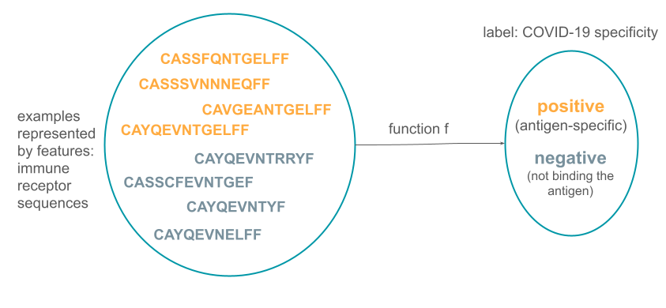
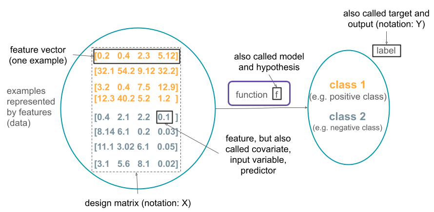
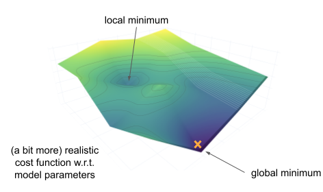

Introduction to Machine Learning
===================================

.. note::

  Aim: get an idea of what machine learning is, what types of problems it can help solve, what some assumptions are made,
  what the workflow is, and what generalization is

  Level: beginner 🌱

What is machine learning?
---------------------------

There are many definitions on machine learning (ML):

  "Machine learning refers to extracting patterns from raw data"

  "Machine learning is essentially a form of applied statistics with increased emphasis in the use of computers to statistically estimate complicated functions and a decreased emphasis in proving confidence intervals around these functions."

-- Goodfellow et al. 2016

  "A computer program is said to learn from experience E with respect to some class of tasks T and performance measure P, if its performance at tasks in T, as measured by P, improves with experience E."

-- Mitchell 1997

One possible view of machine learning is as it is performing a function approximation task. In the example below, there is a set of images for which the task
is to predict if they contain a cat or a a dog. Those images are called examples in ML and are represented by features.
The function f is then estimated in order to predict what the label is for each image. The labels here can be either CAT or DOG.

.. image:: ../../_static/images/ML_as_fn_approximation.png
   :alt: This figure shows a set of examples in machine learning (a set of pictures containing either a cat or a dog), a set of label (CAT, DOG) and a function f that maps between these two sets.

The same problem setup would apply if we wanted to estimate the function f that would for predict if an adaptive immune receptor (that mounts
specific immune response to e.g., viruses or bacteria) binds a COVID-19 antigen.

More generally, each example is represented by a feature vector that describe examples in a way that is suitable to estimate the function of interest.
This function takes a feature vector as input (in a format of a design matrix) and provides the label (class) as output.

The types of problems in machine learning
--------------------------------------------

The example described above illustrates one type of problem machine learning can tackle, called **supervised learning**. In this setup,
for each example, there is a known label of interest that we wish the function f to predict. The label can be a discrete value,
representing a class (e.g., binding an antigen or not, image is of a cat or a dog), in which case it is called classification. If
the label is continuous value, such as binding affinity, it is a regression task.

If there are no labels that we want to predict, but instead we want to find some structure in the data, the setup is called
**unsupervised learning**. For instance, if we have the scRNA-seq of some cell population, clustering might reveal new cell types
(e.g., `Villani et al. 2017 <https://www.science.org/lookup/doi/10.1126/science.aah4573>`_).

Reinforcement learning describes the setting in which the program (agent) interacts with the environment. The labels are not provided
directly (to help the agent choose the sequence of actions), but it is known how good the action is. The agent then combines explorations
of new actions with exploiting the knowledge of previously taken actions to find the optimal set of actions. For example, one such
task could be finding the optimal dosing policy for the medication.

Assumptions about the data
---------------------------------

There exists a data generating process that creates the data and gives rise to the probability distribution P\ :sub:`data`\.
What we typically assume about the data is:

- the examples in the dataset we have for some task are independent of each other, and

- when we want to use machine learning on some new data, we assume those data come from the same data generating process
  (come from the same probability distribution).

These two assumptions are called the i.i.d. assumption (independent and identically distributed).

With these assumptions (approximately) satisfied, we can choose the data representation and estimate the function f of interest.

Estimating the function and the training procedure
------------------------------------------------------

To estimate the function f in the supervised setting that will predict the labels Y based on the data X so that f(X) ≈ Y, we need to have some
labeled data (e.g., a set of sequences for which we know if they will bind the antigen or not). We then need to come up with a way to represent that
data (encode the data) in a way that is suitable for the problem at hand. For example, in antigen binding example, one encoding could be representing
the sequence by its biochemical properties. Encoded and labeled data are then provided to the machine learning model (function).

The parameters of the function are tuned so that the for the data we have, the tuned function predicts the labels as well as possible. This includes
a few steps: initializing the parameters of the function and then iteratively predict the label Y from the encoded training data X,
compute the cost function (showing how much the predicted labels differ from the known labels), and update the parameter of the
function f to reduce the cost function and get better prediction. This process is repeated until the cost function (prediction
error) becomes sufficiently small or until the maximum number of iterations has been reached.

These steps are shown in the figure:

The data used to estimate the function is called the training data. However, it cannot be used to estimate how well the function
f that was estimated predicts the label Y. This is because the training data was already used during training, so every estimate
based on the same data will be overly optimistic. To see how well the function f works once we deploy it, we need to use the
data that we have not used for training. This data is referred to as test data.

Once we have test data, to estimate the performance of the fitted function f, we will encode the test data in the same way as
the training data was encoded previously, feed it to the function f and examine the predictions made. We will check if the
predictions function f made match the true label Y. Based on this we will estimate the performance of the function f when applied
to the new test data where each example is independent of others and the examples come from the same distribution as the
training data.

This process is shown in the figure below:

.. image:: ../../_static/images/ML_process_test.png
   :alt: This figure shows the next step of the ML process: encoding raw labeled test data and feeding it to the estimated function to check the function's performance, by e.g., measuring accuracy.

Performance metrics
~~~~~~~~~~~~~~~~~~~~~~~

To estimate how well the function f works on a certain domain, depending on the problem, different performance metrics can be defined.

If label values are continuous (such as binding affinity of a sequence), this is a regression task, and one commonly used metric
is mean squared error (MSE) showing how much on average the predicted value differs from the true value:

.. image:: ../../_static/images/MSE.png
   :width: 50%
   :alt: This figure shows the mathematical expression for the mean squared error: 1/m * sum over all m examples of the squared difference between the true value for the label for example and the predicted value for that example.

Other regression metrics include mean absolute error, R\ :sup:`2`\.

In classification setting, where the labels come from a discrete set (e.g., a sequence binds an antigen (label: 1) or not (label: 0)), metrics include
accuracy (the percentage of correct predictions), balanced accuracy, precision, recall, sensitivity, specificity, ROC curve,
area under the ROC curve (AUC or AUROC), cross-entropy etc. In the binary classification case (only 2 classes), we can also
distinguish between true positives (e.g., true label is 1 and it is predicted as 1 by the model), true negatives (label is 0 and
0 is predicted), false positives (predicted value is 1 but the true value is 0) and false negatives (predicted value is 0 but the
true value is 1). These notions can be useful to define other metrics listed above.

 the sum of true positives, true negatives, false positives and false negatives.

Training the machine learning model
~~~~~~~~~~~~~~~~~~~~~~~~~~~~~~~~~~~~~~~~

Now that a way to measure how good the model is was described above, we describe the procedure used to fit the model. The description here
aims to provide an intuition of how it works, and does not go into much details.

The performance metric defines how well the model predicts. Usually the problem of training a model is defined as the procedure of
minimizing the cost function (e.g., minimizing the mean squared error or maximizing the accuracy). One iterative algorithm frequently used
for this is called gradient descent. The following steps are repeated until the optimal solution or the maximum number of iterations
is reached:

1. Find derivative of the cost function with respect to each of the parameters of the model.

2. Update each parameter incrementally using the cost function as a starting point for the update computation.

The idea is that if we repeat this, we will gradually improve the model until we reach satisfactory performance.

 the middle lower part of the function curve representing the optimal set of parameter values. There are also a few arrows following the function curve from initial to optimal parameters showing how the cost function changes with each iteration.

The cost function typically looks much more complex that this illustrative example, and if it is not a convex function, we might
not know if the point being evaluated is a local or a global minimum. However, even finding a local minimum might be sufficient.

Machine learning workflow
~~~~~~~~~~~~~~~~~~~~~~~~~~~~~~

Putting all this together, a full machine learning workflow typically looks like this: the original dataset is split into two:
training and test. Training dataset (where a small portion can again be left out for validation) is then used to train an ML model,
assess the performance and maybe even choose between two ML models if we need to decide between two. The best ML model can
then be refitted on the full training dataset and its performance assessed on the test set that was not used during the training
nor choosing between models. Because the test dataset was not used during training, the performance of the model on the test data
will typically be worse than on the training dataset, but it is still a more accurate estimate of the performance on the new data.
This is shown in the figure below.

.. image:: ../../_static/images/ml_workflow.png
   :alt: a schema of the ML process as described in the previous paragraph

Generalization in machine learning
--------------------------------------

Generalization in machine learning refers to the ability of an ML model to perform well on previously unseen data (independent examples coming
from the same distribution as the training dataset). The error on
the test set (from the process described in the previous section, where error is just the value of the cost function) is often
used as an estimate of the generalization error. Generalization error is then the expected error on new data.

Ideally, a good model that we obtain from this procedure will have a small error on the training dataset and a small gap between
the training set error and the test set error. These two might contradict each other: if the trained model could learn an
arbitrary function and the aim is to minimize the prediction errors, if the model learned every example exactly and its corresponding
label, it would have perfect prediction on the training set. However, when it gets a new example from the test set (and this
example is not seen before), it will not be able to predict its class because it fails to generalize.

For example, if the
method's aim was to predict if a picture contains a cat or a dog, and it did so by memorizing pictures exactly, if we constructed
a new cat picture by taking one from the training set and rotated it by a few degrees, it would not be able to correctly
classify it.

When the model fits the training data well (too well), but fails to extract patterns that would enable good performance on the
new (test) data, this phenomenon is called overfitting. Underfitting on the other hand happens when the model is not able to learn from
the training data, when it had high training error. This can happen when the model is too simple for the target task, for example.

This is illustrated in the figure below. The training error is shown to monotonically decrease with increasing complexity of the model.
The generalization error decreases up to a certain point before it starts rising again. The minimum of the generalization error
maps to the optimal model complexity. The difference between the generalization and training error is called generalization gap.
If the model is too simple (left of the optimal model in the graph), the model underfits the task. If the model is too complex
(right of the optimal model in the graph), the model overfits.

.. image:: ../../_static/images/generalization.png
   :alt: a graph showing the cost function (error) on y axis and model complexity on the x axis; plotted are the training error curve and the generalization error; they both decrease until optimal model complexity and then split: the training error continues to decrease, while the generalization error goes up; the difference between these errors is labeled as generalization gap

References
--------------

- Goodfellow IJ, Bengio Y, Courville A. Deep Learning. MIT Press; 2016. https://mitpress.mit.edu/books/deep-learning

- Mitchell T. Machine Learning. McGraw Hill; 1997. http://www.cs.cmu.edu/~tom/mlbook.html