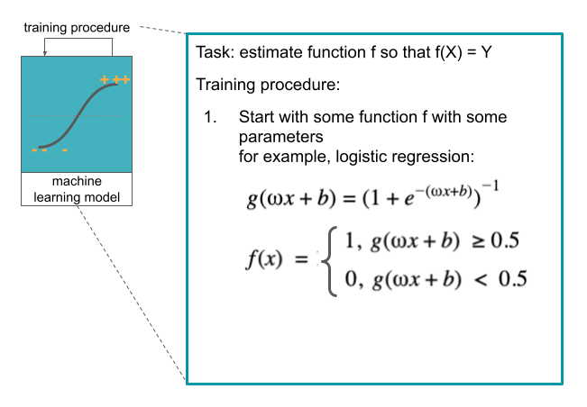
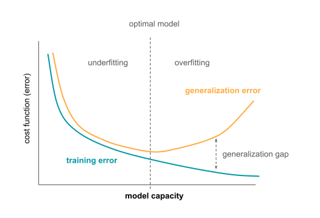
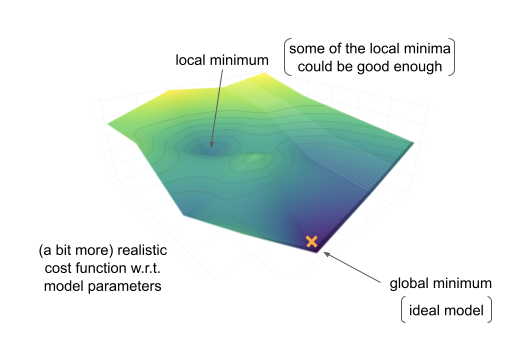
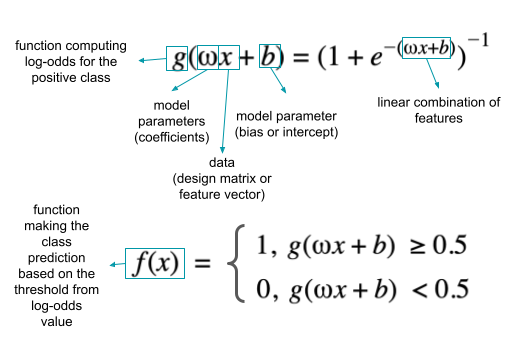
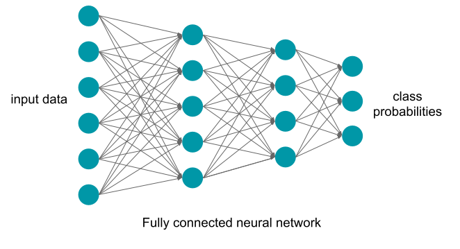
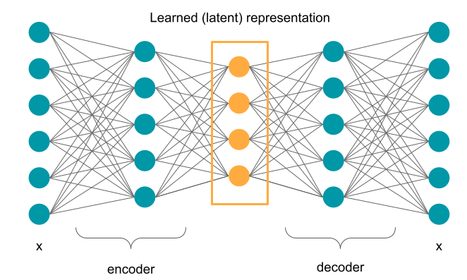

Introduction to machine learning models and algorithms
=========================================================

.. note::

  Aim: learn what a machine learning model is, supervised and unsupervised learning

  Level: beginner 🌱

In the previous section :ref:`Introduction to Machine Learning`, logistic regression was mentioned
as a simple option for binary classification. The task was to estimate the function f, so that
f(X), where X is the data, is approximately equal to the labels Y. The specific format of the
function f(X) and its parameters (ω and b) are shown in the figure below.

But what is a machine learning model? And how models differ between each other? That is the topic of this section.

What is an ML model and an ML algorithm?
----------------------------------------------

`Dietterich 1998 <https://direct.mit.edu/neco/article/10/7/1895/6224/Approximate-Statistical-Tests-for-Comparing>`_ defined the following:

- **Learning algorithm**: a function that, given a set of examples and their labels, constructs a model (e.g., logistic regression)

- **Model**: a function that was fit to the data using the learning algorithm (e.g., logistic regression with specific parameter values)

These terms are sometimes used interchangeably, but from these definitions, they are a bit different.

Overview of ML and statistical algorithms
~~~~~~~~~~~~~~~~~~~~~~~~~~~~~~~~~~~~~~~~~~~~~~

There are many different learning algorithms. They differ in their assumptions about the function to be estimated and the type of
function they can estimate.

Classification algorithms estimate functions that have discrete outputs that represent different classes the functions aim to predict.
Some classification algorithms are logistic regression, naive Bayes, decision trees, support vector machine (SVM), neural networks,
k-nearest neighbors (kNN). There are also algorithms that construct multiple models of the same type and then use them together to
make predictions. These are called ensemble methods and include random forest (multiple decision trees), boosting and bagging algorithms.

Regression algorithms, on the other hand, have continuous outputs. Algorithms include linear regression, polynomial regression,
stepwise regression, ridge and lasso regression, elastic net, support vector regression, neural networks.

Classification and regression algorithms are useful when the data is labeled (either with a class they belong to or some continuous value). When
no labels are available, the structure of the data needs to be analyzed in an unsupervised manner. Some unsupervised algorithms
include k-means clustering, hierarchical clustering, mixture models, autoencoders.

What can ML algorithms learn: capacity and the hypothesis space
----------------------------------------------------------------------

An algorithm's **capacity** can be informally defined as its ability to fit a wide variety of functions. For example, linear
regression and polynomial regression look like this:

.. math::

   \hat{y}_{linear\,regression} = b + ωx

   \hat{y}_{polynomial\,regression} = b + ω_1x + ω_2x^2

From these equations, it is possible to see that every function that linear regression model can learn, it is also possible to
learn with polynomial regression if :math:`ω_2` is set to 0. If on the other hand :math:`ω_2` is not zero, polynomial regression
can learn many more different functions that depend not only on :math:`x`, but also :math:`x_2`. So, polynomial regression has
higher capacity than linear regression.

The capacity is also related to overfitting and underfitting from :ref:`Generalization in Machine Learning` in the previous section.
If the algorithm has low capacity for the task at hand, it might not be able to learn the function f, and it might underfit.
If the algorithm's capacity is too high for the task (e.g., when fitting a polynomial regression when the true function is linear),
the algorithm might overfit and learn the training data too well, failing to generalize to new data later. There are ways to prevent
this that will be discussed later.

**Hypothesis space** (function space) is a set of functions that the algorithm can choose as the optimal solution. Choosing the hypothesis space controls
the capacity of the algorithm. Given that an optimal hypothesis (function) is chosen, in theory it is possible to obtain the ideal
model (called oracle) that knows the true probability distribution that generates the data. In biology, this "true probability distribution"
refers to the data generating process and the biological mechanism behind it. The minimal error achieved by an ideal model that
occurs due to e.g., noise in the data, is called **Bayes error**.
However, more realistically, the algorithms would learn only the (statistical) approximation of the task.

Searching through the hypothesis space using optimization algorithms
~~~~~~~~~~~~~~~~~~~~~~~~~~~~~~~~~~~~~~~~~~~~~~~~~~~~~~~~~~~~~~~~~~~~~~~~~~~

Fitting the parameters of the model (finding the best parameter values for the task) is an
optimization problem. There are different algorithms that perform this optimization, but one of
the most common algorithms is gradient descent, that was already described in :ref:`Training the machine learning model` in
the previous section. With this algorithm, it is possible to get stuck in a local minima of the
cost function, but if the performance is good enough, that might still be acceptable.

Gradient descent minimizes the cost function to find optimal model parameters:

.. math::

   \text{optimal_parameters} = \underset{parameters}{\mathrm{argmin}} \{ \text{cost_function}(\text{parameters} | \text{train_data})\}

If some (domain) knowledge is available to inform what the function is expected to look like, it is possible to
add constraints to this equation and restrict the parameter values the function can have.

This is done by adding an additional term to the standard cost function (e.g., cross-entropy) that
will increase the value of the cost function if the model does not respect the added regularization:

.. math::

   \text{optimal_parameters} = \underset{parameters}{\mathrm{argmin}} \{ \text{cross_entropy}(\text{parameters} | \text{train_data}) + \alpha \, \text{regularization}(\text{parameters})\}

Parameter :math:`\alpha` is the regularization constant and defines how much the cost function will increase if the parameter values do not follow the
constraints.

The regularization (also called penalty) depends on the prior beliefs on the values parameters can take. These often include the assumption that
the parameter values might be sparse (some of them should be 0) or that their values should be small. In the first case, to
ensure sparsity, one might use so called L1 regularization where the regularization term is the sum of the absolute parameter values:

.. math::

   regularization(parameters) = \sum_{i} | parameter_i |

L1-regularized models are typically sparser and simpler than non-regularized ones. L2-regularization shrinks all parameter values
proportionally:

.. math::

   regularization(parameters) = \sum_{i} parameter_i^2

L1 also corresponds to Lasso and L2 to ridge regression.

Examples of machine learning algorithms
--------------------------------------------

Supervised learning
~~~~~~~~~~~~~~~~~~~~~~~

Logistic regression mentioned before, is one example of a statistical learning algorithm for binary classification. Its parameters are shown in the figure
below.

A single node in a neural network does something similar. It computes a non-linear activation function on the linear combination of inputs X, weights w and
bias term b.

.. image:: ../../_static/images/NN_node.png
   :alt: a neural network node computes the sigmoid (non-linear activation) function on the linear combination of inputs, weights and bias term

A neural network consist of many such nodes organized into layers. This hierarchical structure makes them
very powerful as they can fit a large variety of different functions. An example of a neural network is shown below.

Neural networks work by computing the activations for each layer based on the activations from the previous one to make the predictions. They
are trained in the opposite direction with the same gradient descent algorithm described earlier. The difference between the output of the final layer
(their predictions) and the true output (true labels) is computed and used to update the parameters (weights) throughout the network.

The number of nodes per layer and the number of layers are set in advance by the practitioner. They are hyperparameters: parameters of
ML algorithms that are not tuned during training. Instead, a set of possible configurations of hyperparameters can be provided in
advance, and optimized over on data not used for training (validation data).

There are different types of neural networks, and some of them are:

- fully connected networks (as shown above) where every node in one layer is connected to every node from the previous layer,

- convolutional neural networks that detect position-invariant local patterns (e.g., patterns in the DNA sequence such as in `Zeng et al. 2016 <https://doi.org/10.1093/bioinformatics/btw255>`_),

- residual neural networks that can learn both simple (e.g., identity) and more complex functions (`He et al. 2015 <https://arxiv.org/abs/1512.03385>`_),

- recurrent neural networks often used for long-term dependencies, e.g., in sequence data or text.

Unsupervised learning
~~~~~~~~~~~~~~~~~~~~~~~~~

Neural networks with a slightly different configuration can be also used in unsupervised learning scenario. Autoencoders are
neural networks trained to reconstruct its input in the final layer while fitting the latent representation in its middle layer.
The part of the network that transforms the input data into the latent representation is called encoder and the decoder is the part
of the network mapping the latent representation back to the input data. The representation learned in this way can have some
useful properties, such as reduced dimensionality that would make it easier to visualize, but there could be other applications as well.

References
-------------

Dietterich TG. Approximate Statistical Tests for Comparing Supervised Classification Learning Algorithms. Neural Comput. 1998;10(7):1895–1923. doi:10.1162/089976698300017197

Goodfellow IJ, Bengio Y, Courville A. Deep Learning. MIT Press; 2016. https://mitpress.mit.edu/books/deep-learning (especially chapter 5 - Machine Learning Basics)

Zeng, Haoyang, Matthew D. Edwards, Ge Liu, and David K. Gifford. ‘Convolutional Neural Network Architectures for Predicting DNA–Protein Binding’. Bioinformatics 32, no. 12 (15 June 2016): i121–27. https://doi.org/10.1093/bioinformatics/btw255

He, Kaiming, Xiangyu Zhang, Shaoqing Ren, and Jian Sun. ‘Deep Residual Learning for Image Recognition’. ArXiv:1512.03385 [Cs], 10 December 2015. https://arxiv.org/abs/1512.03385