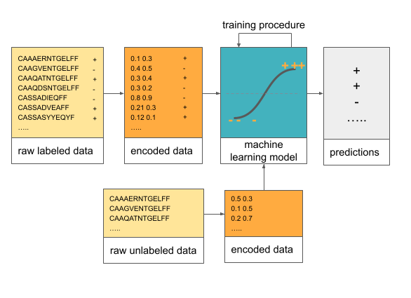

Brief overview of machine learning in computational biology
================================================================

.. note::

  Aim: get an intuition and high-level understanding of what machine learning is and types of problems it can help solving from a
  computational biology perspective

  Level: beginner 🌱

With the development of sequencing technologies, large amounts of data became available that can be examined for biological properties.
For example, from `the VDJdb database <https://vdjdb.cdr3.net/>`_ (`Bagaev et al. 2020 <https://academic.oup.com/nar/article/48/D1/D1057/5582255>`_),
we can retrieve T-cell receptor sequences specific to the epitope YLQPRTFLL of SARS-CoV-2 and discover motifs in these amino acid sequences with or
without genetic background, as shown below (the motifs and the sequences were obtained from VDJdb):

.. image:: ../../_static/images/TCR_motif_example.png
   :alt: This figure shows a table with a list of immune receptor (TCR) sequences and the motifs that were extracted as common in those sequences when adjusted and when not adjusted for the genetic background.

One way we can approach the analysis of these sequences is to build a position weight matrices showing the product multinomial distribution of amino
acids. In this way we can describe these sequences. On the other hand, if we want to predict for a new sequence if it is specific to a virus or not,
we might need a bit different approach.

Machine learning is a powerful approach to discovering patterns in (biological) data
--------------------------------------------------------------------------------------

Machine learning (and statistics) includes a set of methods that allow for making inference about the data. For example if we want to predict if a
receptor sequence will bind the virus or not, we could fit a logistic regression model on the receptor sequence data and then predict the binding for
the new receptors using the model.

ke predictions.

Some applications of machine learning in biology include predicting transcription factor binding, antigen binding, translation initiation site
discovery, splicing prediction, single-cell RNA-seq clustering, variant calling.

For instance, in antigen binding prediction, immune receptors
(proteins) bind to antigens (e.g., parts of viruses) to help eliminate them. The machine learning helps then solve the classification problem of
predicting if a new receptor will bind to an antigen given a set of receptors that are known to bind that antigen (e.g., `Akbar et al. 2021 <https://www.sciencedirect.com/science/article/pii/S2211124721001704>`_).

Transcription factors are proteins that bind to certain sites in DNA and regulate transcription of genes, so the corresponding machine learning
problem can be formulated as follows: given a set of DNA sequences that we know if the transcription factor will bind or not, can we predict if the
same transcription factor will bind to a new DNA sequence (e.g., `Alipanahi et al. 2015 <https://www.nature.com/articles/nbt.3300>`_).

In splicing scenario, where splicing refers to processing of precursor RNA that creates messenger RNA by removing
non-coding regions (introns) and connects gene-coding regions (exons) together, machine learning has been used to predict how often exons will be
included in the transcripts in a regression problem (e.g., `Xiong, Alipanahi and Lee et al. 2015 <https://science.sciencemag.org/content/347/6218/1254806.abstract>`_).

Single-cell RNA-seq clustering can be performed to idenfity new cell types by applying a dimensionality reduction technique on cell count data,
followed by clustering the data, e.g., by using k-means algorithm (e.g., `Kiselev et al. 2019 <https://www.nature.com/articles/s41576-018-0088-9>`_).

.. image:: ../../_static/images/clustering_rna_seq.png
   :alt: This figure shows a plot with principal components 1 and 2 on x and y axis respectively, with points in clusters. When a clustering algorithm is applied, the same plot is shown but the points are grouped into clusters of different colors, and one cluster is labeled to represent a new cell type.

Computational biology poses unique challenges for machine learning
----------------------------------------------------------------------

The unique challenges of computational biology for machine learning come from:

- dimensionality and the dataset size (e.g., immune repertoire data includes over 100 thousand receptors per individual),
- signal and noise in the data (e.g., in immune repertoire field, only very few of hundreds of thousands of receptors per individual is specific to one disease that we want to predict),
- the ground truth is unknown and the datasets might be weakly labeled (e.g., we know that an immune repertoire belongs to a person with the immune disease in question, but we do not know which receptors are specific for that disease),
- there might be selection bias, meaning that there is some preferential selection of data points into the study that might obscure the existing relationships or introduce non-existing ones.

Recommended further reading
------------------------------

- Wainberg M, Merico D, Delong A, Frey BJ. Deep learning in biomedicine. Nature Biotechnology. 2018;36(9):829-838. doi:10.1038/nbt.4233

- Leung MKK, Delong A, Alipanahi B, Frey BJ. Machine Learning in Genomic Medicine: A Review of Computational Problems and Data Sets. Proceedings of the IEEE. 2016;104(1):176-197. doi:10.1109/JPROC.2015.2494198