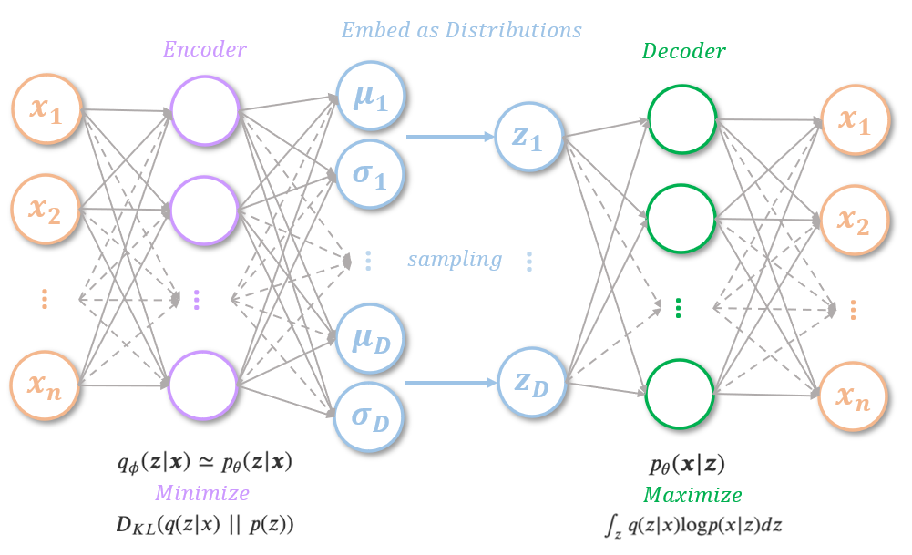
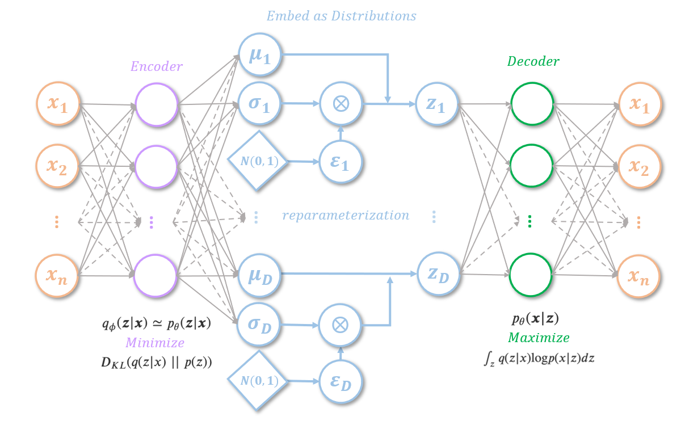
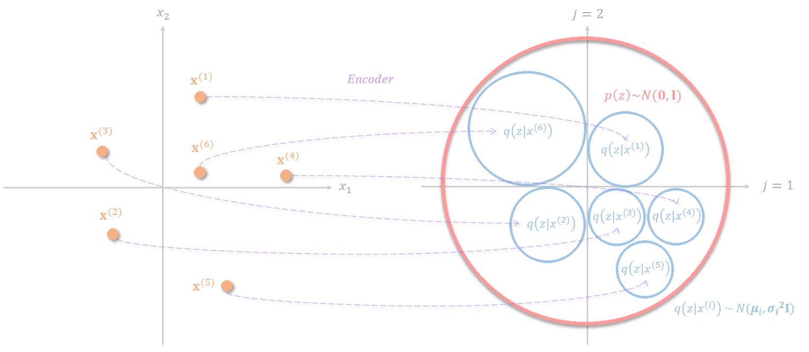
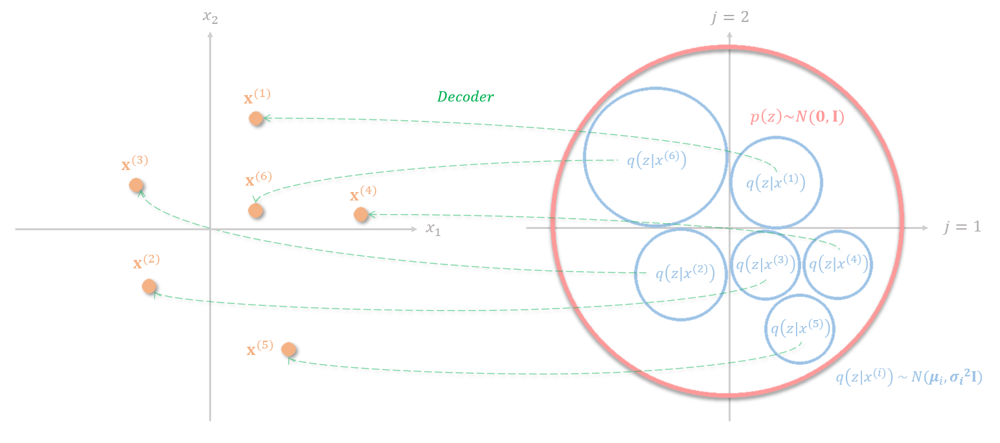
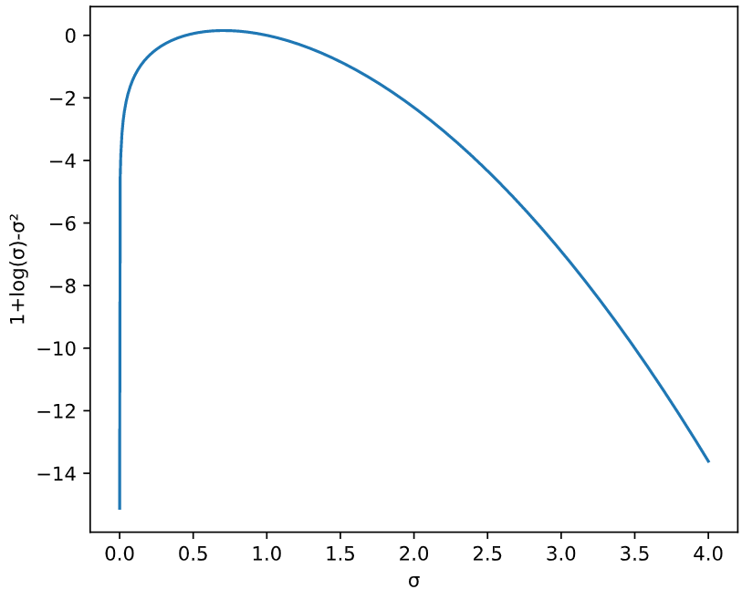

*******************************
Auto-Encoding Variational Bayes
*******************************

Problem Formulation
###################
Suppose our input data :math:`x` is generated from a random process. This random process involves an unobserved continuous random variable :math:`z`, which is generated from another process: :math:`p_{\theta^*}(z)`. Then, given the latent variable :math:`z`, we can derive the conditional probabilistic distribution :math:`p_{\theta^*}(x|z)` that we would like to find. 

However, both the latent variable :math:`z` and the parameter of the random process :math:`\theta^*` is unknown. As we don't know the probability density function :math:`p_\theta(x|z)`, we couldn't use the **expectation-maximization (EM)** algorithm to find :math:`p_{\theta^*}(x|z)`. (EM algorithm is used to find the optimal parameter when the probability density function of a distribution is known)

Another way of finding :math:`p_{\theta^*}(x|z)` is to use the **Monte Carlo EM algorithm**, however, it doesn't scale well to a large dataset. For mean-field approximation, analytical solutions of expectations with respect to the approximate posterior is also required, which is intractable in this application.

Decomposition of Log-Likelihood
###############################
The authors proposed to use a neural network to find an encoder function :math:`q_\psi(x)` to approximate :math:`p_{\theta^*}(z|x)`, and a decoder function to approximate :math:`p_{\theta^*}(x|z)`.

For any probability density function, we can maximize the corresponding log-likelihood with our input data:

.. math::

    \text{log}p(x) & = \text{log}p(x)\int_zq(z|x)dz \\
    & = \int_zq(z|x)\text{log}p(x)dz \\
    & = \int_zq(z|x)\text{log}(\frac{p(x, z)}{p(z|x)})dz \\
    & = \int_zq(z|x)\text{log}(\frac{p(x, z)}{q(z|x)}\frac{q(z|x)}{p(z|x)})dz \\
    & = \int_zq(z|x)\text{log}(\frac{p(x, z)}{q(z|x)})dz+\int_zq(z|x)\text{log}(\frac{q(z|x)}{p(z|x)})dz
  
, where :math:`q(z|x)` is the posterior distribution of :math:`z` given the input data :math:`x`.

Let the first term on the right-hand side be:

.. math::

    L_b = \int_zq(z|x)\text{log}(\frac{p(x, z)}{q(z|x)})dz

, and the second term on the right hand side would be:

.. math::

    D_{KL}(q(z|x)\;||\;p(z|x)) = \int_zq(z|x)\text{log}\frac{q(z|x)}{p(z|x)}dz

Since Kullback–Leibler divergence (KL divergence) is always :math:`\geq 0`:

.. math::
    
    \text{log}p(x) = L_b+D_{KL}(q(z|x)\;||\;p(z|x))\geq L_b+0=L_b

To maximize the log-likelihood of :math:`p(x)`, we try to maximize the lower bound :math:`L_b`, this is also known as the **evidence lower bound (ELBO)** of log-likelihood of :math:`p(x)`.

Let's further decompose :math:`L_b`:

.. math::

    L_b &= \int_zq(z|x)\text{log}(\frac{p(x, z)}{q(z|x)})dz \\
    & = \int_zq(z|x)\text{log}(\frac{p(x| z)p(z)}{q(z|x)})dz \\
    & = \int_zq(z|x)\text{log}p(x| z)dz+\int_zq(z|x)\text{log}(\frac{p(z)}{q(z|x)})dz \\
    & = \int_zq(z|x)\text{log}p(x| z)dz-D_{KL}(q(z|x)\;||\;p(z))

Finally, the log-likelihood can be written as:

.. math::

    \log p(x)=\int_zq(z|x)\log p(x| z)dz-D_{KL}(q(z|x)\;||\;p(z))+D_{KL}(q(z|x)\;||\;p(z|x))

Assume the marginal distribution of :math:`p(z)` follows a standard Gaussian distribution and :math:`q(z|x)` follows a multivariate Gaussian distribution, the second term of the ELBO can be solve by:

.. math::

    -D_{KL}(q(z|x)\;||\;p(z))=\frac{1}{2}\sum\limits_{j=1}^D[1+\log(\sigma_j)-(\sigma_j)^2-(\mu_j)^2]

where :math:`D` is the number of latent dimensions, :math:`\mu_j` and :math:`\sigma_j` is the mean and standard deviation from :math:`j`-th components in the multivariate Gaussian distribution :math:`q(z|x)`.

Reparameterization
##################
The first term of the ELBO can be optimized by many methods, such as the Monte Carlo estimator, however, the authors mention that using the Monte Carlo estimator exhibit high variance. Instead, the author uses a neural network to approximate this term.

However, the parameters for the encoder and the decoder couldn't be optimized using backpropagation as there's a sampling process dependent on the parameters in forward propagation. The authors proposed a reparameterization trick to address this. Instead of sampling from a Gaussian distribution :math:`N(\mu, \sigma^2)` that dependent on :math:`\mu` and :math:`\sigma`, the reparameterization trick sample a Gaussian noise, and use the following equation to approximate the sampling while decoupling the parameters and the sampling process:

.. math::

    z_i = \mu_i+\sigma_i\varepsilon_i

, where :math:`\varepsilon\sim N(0, 1)`. The neural network then becomes:

Decomposition of the Loss Function
##################################

.. math::

    L_b = \int_zq(z|x)\text{log}p(x| z)dz+\frac{1}{2}\sum\limits_{j=1}^D[1+\log(\sigma_j)-(\sigma_j)^2-(\mu_j)^2]

The first term of the ELBO is often referred to as the **reconstruction loss**. For the decoder to correctly decodes the distribution into different data points in the feature space. The embedding distribution for different data points needs to be separated. There are two straightforward ways of achieving this, the first way is to embed the data into distributions with very small standard deviation. However, this makes variational autoencoder degenerates into autoencoder and the network will not be able to generate data points from unseen distributions in the latent space. The second way is to scatter the mean of the distribution of each data point across the entire embedding space, however, the model couldn't learn relevant representation from the data point as well.

The KL divergence term can be thought of as a regularization applies to the latent representation so that the data is constrained with a prior distribution :math:`p(z)\sim N(0, I)`. The KL divergence punishes distributions with large mean values to prevent the distribution from scattering across the entire embedding space and the term :math:`1+\log(\sigma_j)-(\sigma_j)^2` prevent the variance to diminish.

References
##########
#. Auto-Encoding Variational Bayes. Kingma et al., ICLR 2014.
#. Deep Learning DS-GA 1008, New York University. Spring 2018.